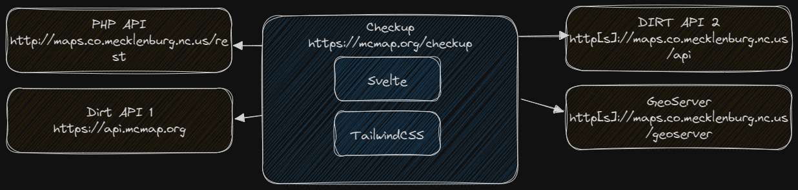

# Checkup

A simple [Svelte](https://svelte.dev/) and [TailwindCSS](https://tailwindcss.com/) site to check the status of some of our web services and ETL jobs.

Site: [https://mcmap.org/checkup](https://mcmap.org/checkup)

## Architecture



Checkup is a single page application (SPA) and progressive web app (PWA). It consumes a number of services to operate, as outlined in the architecture image.

## Using the project

[Node.js](https://nodejs.org/en) is required to run the development and build systems, and [git](https://git-scm.com/) is required to use the versioning system.

### Clone the project
```bash
git clone https://github.com/tobinbradley/checkup.git
```

### Install dependencies
```bash
cd checkup
npm install
```

### Start the development server
```bash
npm run dev
```

Navigate a web browser to [http://localhost:3000](http://localhost:3000) to view the HMR live development server.

### Build for production
```bash
npm run build
```

After the build is complete, copy the contents of the `dist` folder to the production web server.